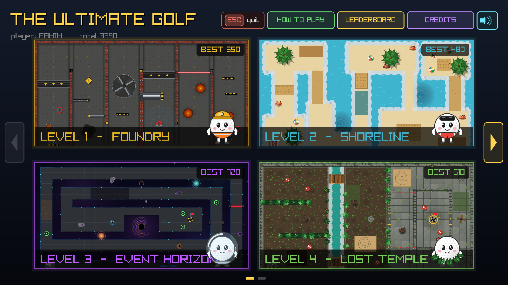
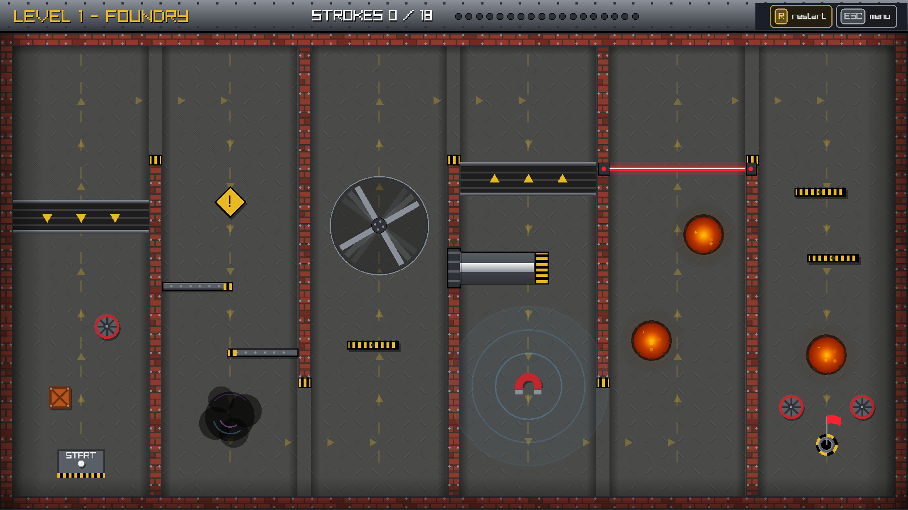
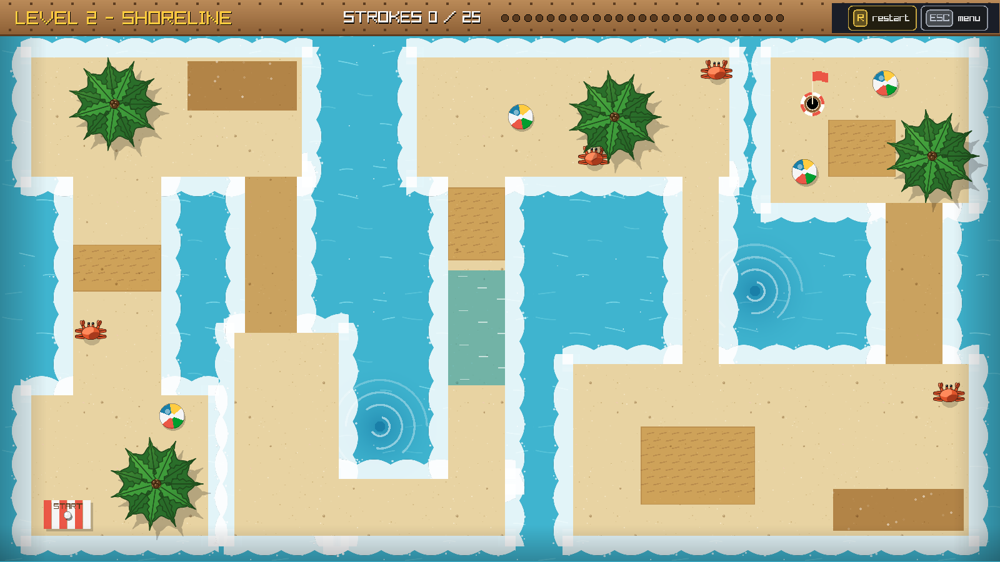
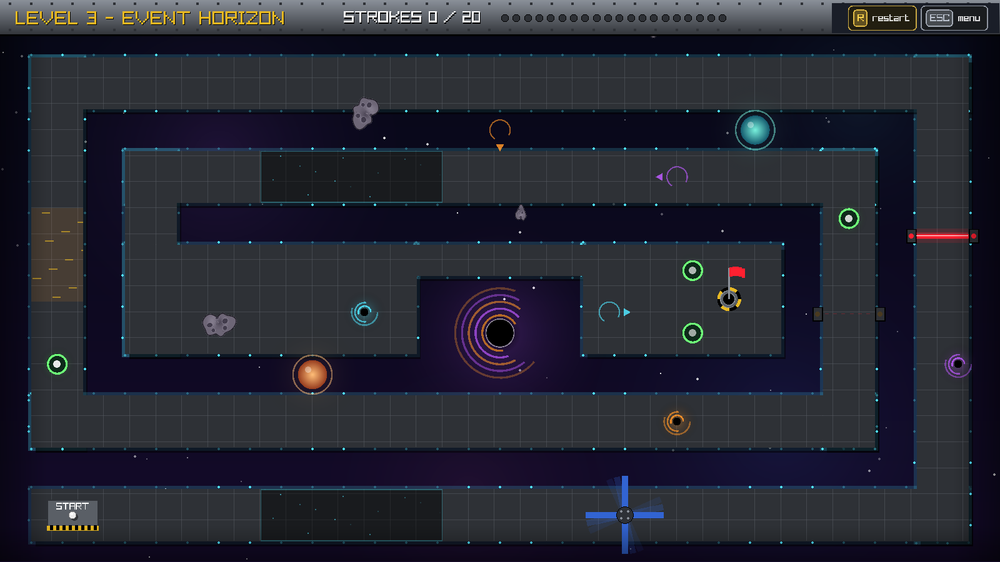
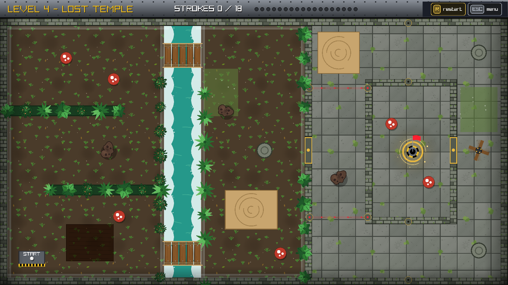
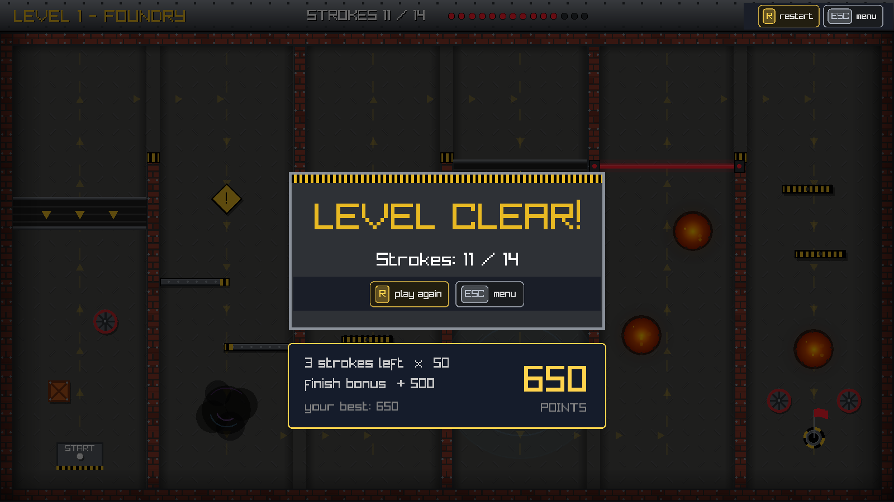
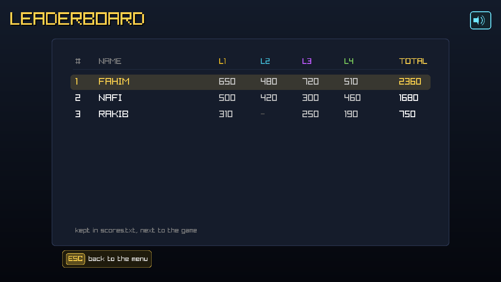

# The Ultimate Golf

A 2D mini-golf game in C with [raylib](https://www.raylib.com/). Four hand-built courses, each with its own world and its own set of traps: a foundry, a shoreline, a black hole, and a temple in the jungle.

Drag back from the ball, let go, and try to reach the hole before your strokes run out.

### [⬇ Download and play (Windows)](https://github.com/Fahim-2135/the-ultimate-golf/releases/latest)

Unzip it, double-click the exe. No compiler, no raylib, no install.



---

## The four levels

| | |
|---|---|
|  **1 — Foundry** <br> Conveyor belts, a hydraulic piston, a laser gate, a magnet and a molten pit. |  **2 — Shoreline** <br> A tide that floods half the course every 8 seconds, rip currents, whirlpools and crabs. |
|  **3 — Event Horizon** <br> Gravity wells, one-way wormholes, a spinning satellite, and a UFO that can abduct the ball. |  **4 — Lost Temple** <br> Crumbling plank bridges, quicksand, dart traps, pressure plates and sliding stone doors. |

## What's in it

- **Four full courses**, roughly 45 different obstacles between them
- **Three difficulties** — Bot, Chad and Goat — which change the stroke limit, how fast the obstacles move, and how much of an aim line you get
- **A briefing before every level** that names and shows every obstacle in it, with live pictures taken from the running level
- **Scoring and a local leaderboard**, saved to `scores.txt` and kept between sessions
- **An animated intro** that runs all four levels as its backdrop
- **30 sound effects and per-level ambience**, with a mute switch that works from any screen
- Everything is drawn by raylib or from sprites — no game engine, no physics library



## How to play

| | |
|---|---|
| **Drag and release** | Pull back from the ball with the mouse. The further you pull, the harder the hit. |
| **R** | Restart the level |
| **ESC** | Back to the menu |
| **M** | Mute or unmute |

Every shortcut is also a button on screen, so the mouse alone is enough.

Water, lava, the void, quicksand and the traps all put the ball back where you shot from — they cost you position, never a life.

**Scoring:** `(stroke limit − strokes used) × rate + finish bonus`, where the rate is 10 on Bot, 25 on Chad and 50 on Goat, and the bonus is 100 / 250 / 500. Your best score on each level is kept.



## Building it

You need a 64-bit GCC and raylib 5 or newer.

```
gcc -Wall src/the_ultimate_golf.c -o the_ultimate_golf.exe \
    -I<raylib>/include -L<raylib>/lib \
    -lraylib -lopengl32 -lgdi32 -lwinmm
```

On Linux, swap the last three for `-lraylib -lGL -lm -lpthread -ldl -lrt -lX11`.

Run it **from the project root**, so that it finds `assets/`. The window opens borderless and fills the screen; it scales to any resolution from a single `u` factor, so it looks the same at 1366×768 as at 4K.

## How the code works

The whole game is one C file, built as four level modules plus a shell that owns the intro, the menu, the briefings, the scoring and the sound. There are no classes, no inheritance and no hidden state — a level is a set of globals and four functions (`start`, `update`, `draw`, `unload`).

**[Read the full code guide →](https://fahim-2135.github.io/the-ultimate-golf/)**

It's a 114-section walkthrough of the entire codebase, from the game loop and the collision maths up to the level systems, the graphics tricks and the testing tools. Every code box in it is pulled straight out of the source.

## Layout

```
src/        the game, one file
assets/     sprites and audio
docs/       the code guide (published with GitHub Pages)
screenshots/
```

## Credits

Built by **Syed Abdul Fahim** (2505114) and **Abdullah Al Nafi** (2505093).

- Sprites and textures: generated with AI
- Sound effects and music: [freesound.org](https://freesound.org), under their respective licences
- Built with [raylib](https://www.raylib.com/) by Ramon Santamaria and its contributors

## Licence

The code is MIT — see [LICENSE](LICENSE). The assets are **not** covered by it: the audio keeps whatever licence it carries on freesound.org, so check there before reusing any of it.
